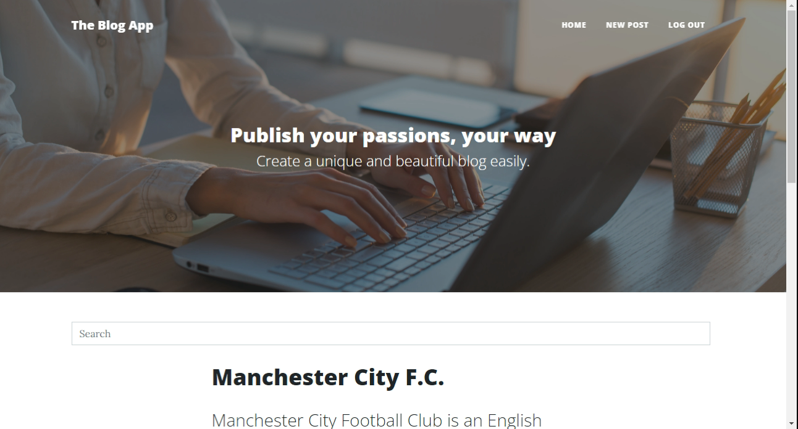

# The Blog App
> lets users write blog entries once they sign up with an account,After the user registers, he/she can go to the homepage and login with his/her credentials. The navigation
 bar will dynamically show different items depending on the user being logged in or out.
> Live demo [The Blog App](https://vast-coast-06462.herokuapp.com/). <!-- If you have the project hosted somewhere, include the link here. -->

## Table of Contents
* [General Info](#general-information)
* [Technologies Used](#technologies-used)
* [Features](#features)
* [Screenshots](#screenshots)
* [Usage](#usage)
* [Project Status](#project-status)
* [Acknowledgements](#acknowledgements)
* [Contact](#contact)
<!-- * [License](#license) -->


## General Information
- This app was build to publish and read blogs 
- app to increase my knowledge in node and mongoDB/mongooes
<!-- You don't have to answer all the questions - just the ones relevant to your project. -->


## Technologies Used
* Node- version 16.13.0
* Express - version 4.18.1
* Mongodb - version 4.6.0
* Bootstrap - version 5


## Features
List the ready features here:
- User Login and Logout
- dynamic rendering of page base on if user is login or logout
- allow user to posts with images
- allow user to perform crud operation


## Screenshots

<!-- If you have screenshots you'd like to share, include them here. -->


## Usage

```
$ npm install
$ npm start

```


## Project Status
Project is:  _inprogress_.


To do:
- allow user to perform delete operation on post
- allow user to perform update operation on post


## Acknowledgements
- This project was inspired by...
- Beginning Node.js, Express & MongoDB Development[Get the book](https://www.amazon.com/Beginning-Node-js-Express-MongoDB-Development/dp/1078379556).


## Contact
Created by [@oba.code]([https://www.flynerd.pl/](https://www.instagram.com/oba.code/)) - feel free to contact me!


<!-- Optional -->
<!-- ## License -->
<!-- This project is open source and available under the [... License](). -->

<!-- You don't have to include all sections - just the one's relevant to your project -->
